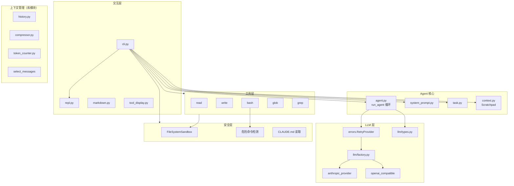
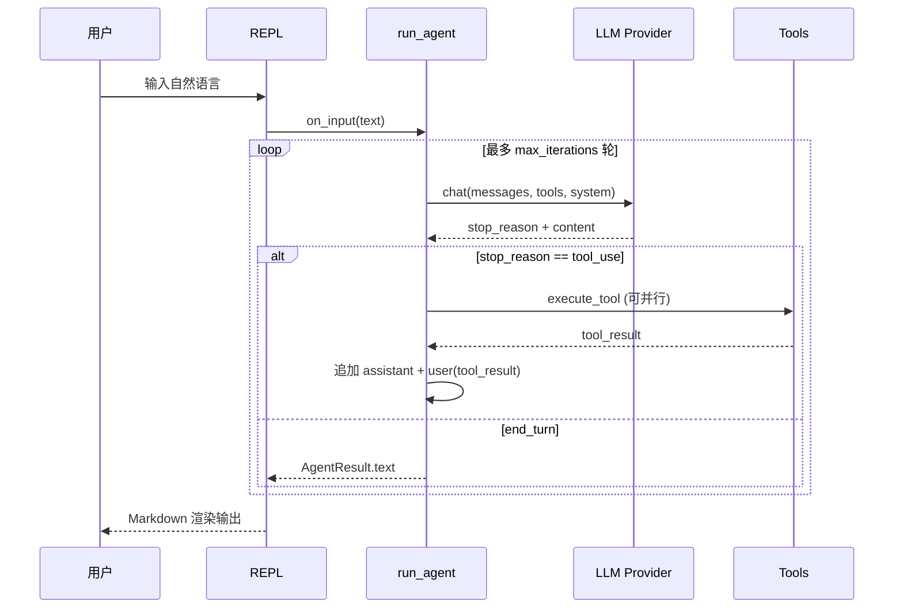

# code-agent

从零实现的 **AI 编程 Agent** 教学/参考项目：覆盖 LLM 接入、Tool Use、Agent 循环、上下文管理、安全沙箱与 CLI 交互。代码结构清晰、模块可测，适合理解 Code Agent 的核心原理。

## 快速开始

### 环境要求

- Python ≥ 3.11
- DeepSeek / OpenAI 兼容 API Key

### 安装与运行

```bash
# 克隆后进入项目目录
cd code-agent

# 创建虚拟环境并安装依赖
python -m venv .venv
source .venv/bin/activate
pip install -e ".[dev]"

# 配置 API Key（二选一）
export DEEPSEEK_API_KEY="your-key"
# export OPENAI_API_KEY="your-key"

# 可选：模型与端点
export LLM_BASE_URL="https://api.deepseek.com"
export LLM_MODEL="deepseek-chat"

# 在目标项目目录下启动 Agent（操作对象为当前工作目录）
python cli.py
# 或
./src/start.sh
```

### 环境变量

| 变量 | 说明 | 默认值 |
|------|------|--------|
| `DEEPSEEK_API_KEY` / `OPENAI_API_KEY` | LLM API 密钥 | （必填） |
| `LLM_BASE_URL` | OpenAI 兼容 API 地址 | `https://api.deepseek.com` |
| `LLM_MODEL` | 模型名称 | `deepseek-chat` |
| `AGENT_NAME` | CLI 显示名称 | `AI Coding` |
| `AGENT_ICON` | CLI 图标 | `🤖` |

### REPL 命令

| 命令 | 说明 |
|------|------|
| `/help` | 显示帮助 |
| `/tasks` | 查看当前任务列表 |
| `/notes` | 查看 Scratchpad 笔记 |
| `/reset` | 清空任务与 Scratchpad |
| `/clear` | 清屏 |
| `/exit` | 退出 |

项目根目录可放置 `CLAUDE.md`（或 `.claude/CLAUDE.md`），内容会自动注入系统提示词。

---

## 架构设计

整体采用 **分层 + 可组合模块** 设计：上层 CLI/REPL 组装下层能力，核心逻辑与 UI 解耦，便于单测与替换实现。



### 请求处理流程（单次用户输入）



### 目录结构

```
code-agent/
├── cli.py                 # 入口：组装 Provider、工具、安全、REPL
├── demo.py                # LLM 最小调用示例
├── src/
│   ├── agent.py           # Agent 循环（tool use 多轮）
│   ├── context.py         # Scratchpad + 消息裁剪 + 注入检测
│   ├── compressor.py      # LLM 摘要压缩长对话
│   ├── history.py         # 多轮消息历史
│   ├── task.py            # 任务规划工具（task_create/update/list）
│   ├── system_prompt.py   # 可组合系统提示词构建器
│   ├── safety.py          # 文件沙箱、危险命令、项目配置
│   ├── errors.py          # API 重试、工具异常包装
│   ├── repl.py            # 交互式命令行
│   ├── token_counter.py   # Token 估算
│   ├── markdown.py        # 终端 Markdown 渲染
│   ├── tool_display.py    # 工具执行 Spinner / 展示
│   ├── llm/
│   │   ├── types.py       # Message、Tool、ContentBlock 等统一类型
│   │   ├── factory.py     # Provider 工厂
│   │   ├── helpers.py     # 从响应中提取 text / tool_use
│   │   ├── anthropic_provider.py
│   │   └── openai_compatible.py
│   └── tools/
│       ├── read.py        # 读文件
│       ├── write.py       # 写文件
│       ├── bash.py        # 执行 Shell
│       ├── glob.py        # 文件名模式匹配
│       └── grep.py        # 内容搜索
└── tests/                 # 各模块单元测试
```

---

## 功能概览

### 已实现

| 模块 | 能力 |
|------|------|
| **LLM 接入** | 统一 `LLMProvider` 协议；支持 Anthropic Claude 与 OpenAI 兼容 API（DeepSeek、Qwen 等）；流式 `stream()` |
| **Tool Use** | 结构化工具定义；多轮 `tool_use` ↔ `tool_result` 循环；可选并行执行多个工具 |
| **内置工具** | `read_file` / `write_file` / `bash` / `glob` / `grep` |
| **任务规划** | `task_create` / `task_update` / `task_list`，辅助复杂任务拆解 |
| **Scratchpad** | `scratchpad_set/get/list`，跨轮次保存计划与发现 |
| **系统提示词** | 分节构建（Role、Rules、Tools、项目说明）；支持优先级与字符预算裁剪 |
| **可靠性** | API 指数退避重试；工具异常转为字符串反馈给模型 |
| **安全** | 文件路径沙箱（限制在项目目录 + 临时目录）；敏感路径黑名单；危险 Shell 命令拦截 |
| **CLI** | 彩色 Banner、REPL、内置命令、工具执行进度 Spinner |
| **上下文（库）** | `MessageHistory`、滑动窗口 `select_messages`、LLM 摘要 `compress_conversation`、注入模式检测 |

### 模块与 CLI 集成情况

部分能力已实现为**独立库模块**，但尚未全部接入 `cli.py`：

| 模块 | 状态 |
|------|------|
| `MessageHistory` | 已实现，CLI 每次输入仍发起**新的** `run_agent`（无跨轮对话记忆） |
| `compress_conversation` | 已实现，CLI 未调用 |
| `provider.stream()` | 已实现，CLI 使用非流式 `chat()` |
| `format_git_context` | 已实现，CLI 未注入 Git 状态 |
| `detect_context_poisoning` | 已实现，工具结果未做注入扫描 |

---

## 与成熟 Code Agent 的差距

与 **Cursor Agent、Claude Code、Aider、Devin、Cline** 等产品级 Agent 相比，本项目侧重「核心链路可读懂」，在工程化与产品能力上仍有明显差距：

### 1. 产品形态与集成

| 能力 | 本项目 | 成熟 Agent |
|------|--------|------------|
| IDE 深度集成 | 仅终端 CLI | 编辑器内联 diff、多文件 Tab、LSP 跳转 |
| 多轮会话 | REPL 每轮独立 Agent 运行 | 持久 Session、可恢复、可分支 |
| 流式输出 | API 支持，CLI 未用 | 实时打字机效果、边生成边展示工具调用 |
| 图形界面 | 无 | 桌面/网页/Webview 面板 |

### 2. 代码理解与检索

| 能力 | 本项目 | 成熟 Agent |
|------|--------|------------|
| 语义索引 | 仅 `grep` / `glob` | 向量库、代码图谱、@codebase |
| 精准编辑 | 整文件 `write_file` | 基于 AST 的 patch、`search_replace`、多 hunk diff |
| 大仓库策略 | 滑动窗口 + 摘要（库模块） | 分层索引、相关文件自动选取、子 Agent 探索 |
| 多语言 LSP | 无 | 定义跳转、引用、类型信息注入上下文 |

### 3. Agent 编排

| 能力 | 本项目 | 成熟 Agent |
|------|--------|------------|
| 子 Agent / 并行探索 | 无 | Task 工具派生子进程、Explore 只读 Agent |
| Plan / Ask 模式 | 无 | 先规划再执行、只读问答模式 |
| 背景任务 | 无 | 长时间任务、通知、可中断恢复 |
| MCP / 插件生态 | 无 | 连接数据库、浏览器、Issue _tracker 等 |
| Hooks / Rules | 仅 `CLAUDE.md` | `.cursor/rules`、pre-tool 钩子、自定义 Skill |

### 4. 工具与执行环境

| 能力 | 本项目 | 成熟 Agent |
|------|--------|------------|
| 工具种类 | 5 个文件/Shell 工具 + 任务/笔记 | Web 搜索、Git、PR、测试、截图、浏览器自动化 |
| 危险操作 | 正则拦截，无真正确认流 | 用户确认 UI、Yolo 模式开关 |
| 沙箱 | 路径限制 | Docker/Firecracker 隔离、网络策略 |
| 测试反馈闭环 | 无内置 | 自动跑 pytest、解析失败并重试 |

### 5. 安全、合规与可观测

| 能力 | 本项目 | 成熟 Agent |
|------|--------|------------|
| 提示注入防护 | 模式检测（未接入主路径） | 工具输出清洗、权限分级 |
| 审计日志 | 无 | 完整 tool trace、可导出 |
| 成本追踪 | `usage` 字段 | Token 统计面板、预算上限 |
| 密钥管理 | 环境变量 | 密钥库、按项目配置 |

### 6. 协作与 DevOps

| 能力 | 本项目 | 成熟 Agent |
|------|--------|------------|
| Git 工作流 | 危险命令拦截 | `commit` / `push` / PR 创建、CI 状态回读 |
| 多模态 | 无 | 截图、设计稿、PDF |
| 团队共享 | 无 | 共享 Session、Code Review Bot |

### 建议的演进路线（按优先级）

1. **CLI 接入 `MessageHistory`** — 实现真正的多轮对话  
2. **流式 REPL** — 使用 `stream()` 改善体验  
3. **Patch 编辑工具** — 减少整文件覆盖带来的冲突  
4. **接入 `compress_conversation` + `select_messages`** — 长会话可用  
5. **Git 上下文注入** — 分支、status、最近 commit  
6. **用户确认流** — 危险命令可批准而非一律拒绝  
7. **MCP 或插件接口** — 扩展外部能力  

---

## 开发

```bash
# 运行测试
pytest tests/ -v

# 仅运行流式相关测试
pytest tests/test_stream.py -v
```

### 切换 Anthropic Provider

```python
from src.llm.factory import create_provider, ProviderConfig

provider = create_provider(
    ProviderConfig(
        provider="anthropic",
        api_key=os.environ["ANTHROPIC_API_KEY"],
        model="claude-sonnet-4-20250514",
    )
)
```

在 `cli.py` 中将 `provider="openai-compatible"` 改为 `"anthropic"` 并配置对应环境变量即可。

---

## 许可证

见 [LICENSE](LICENSE)。
